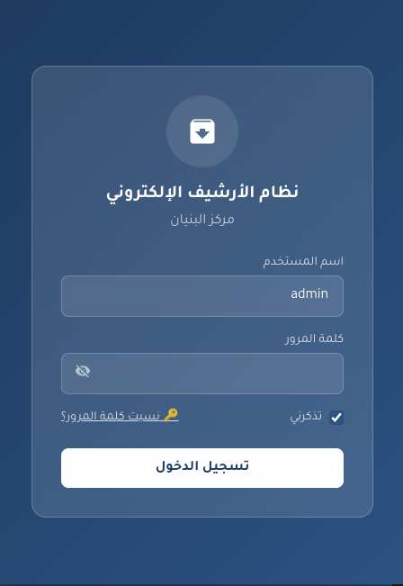
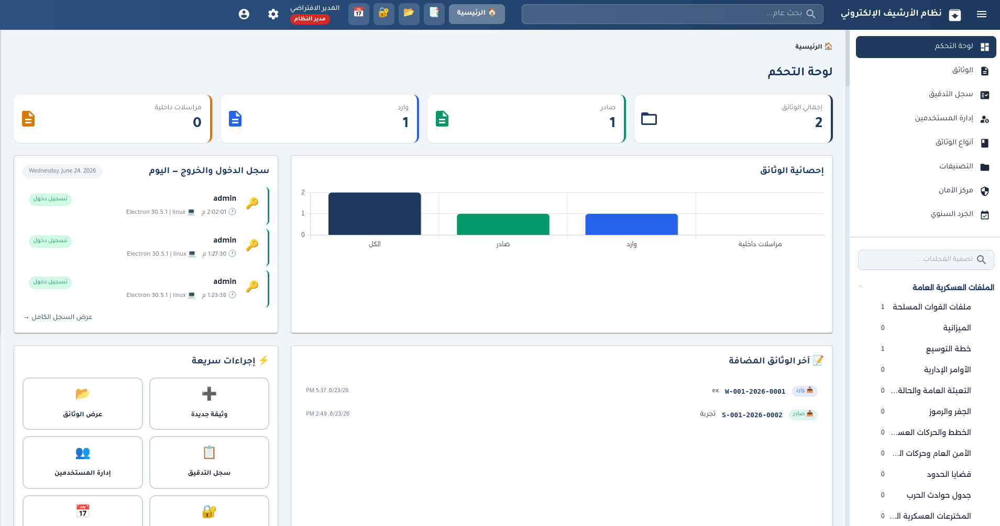
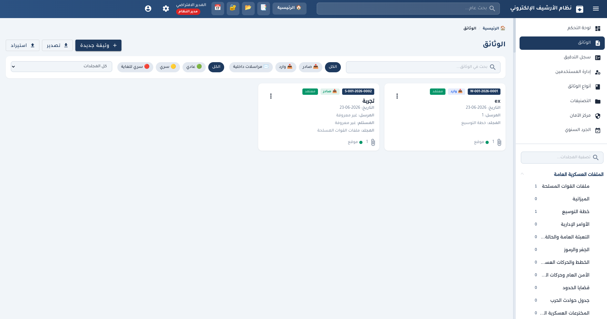
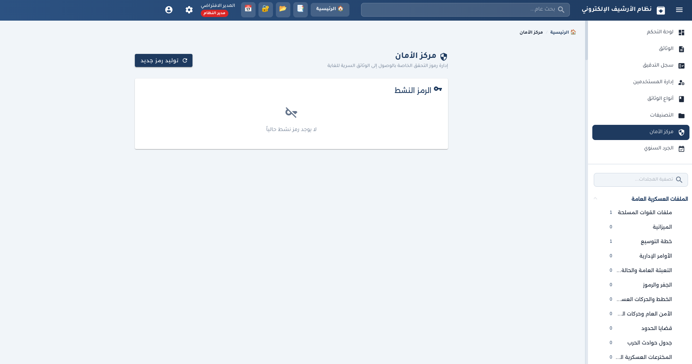
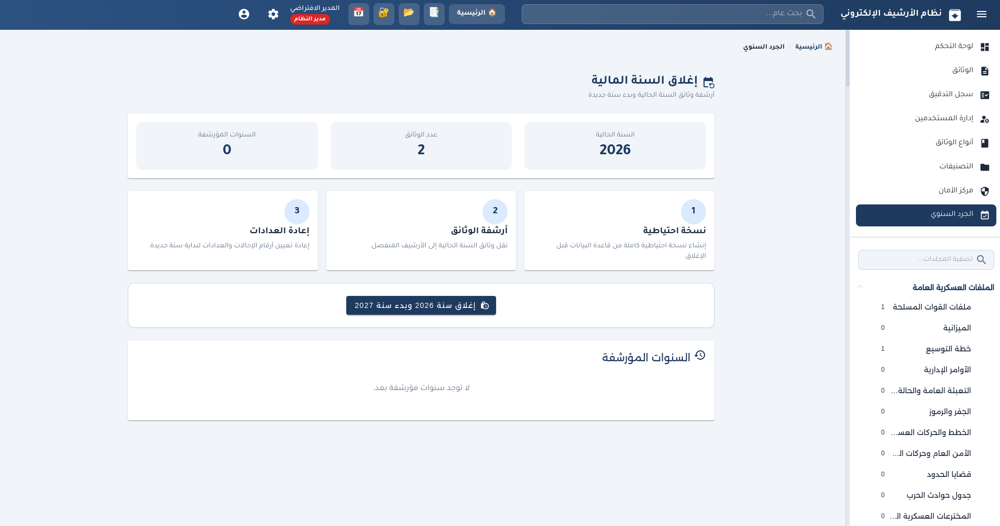
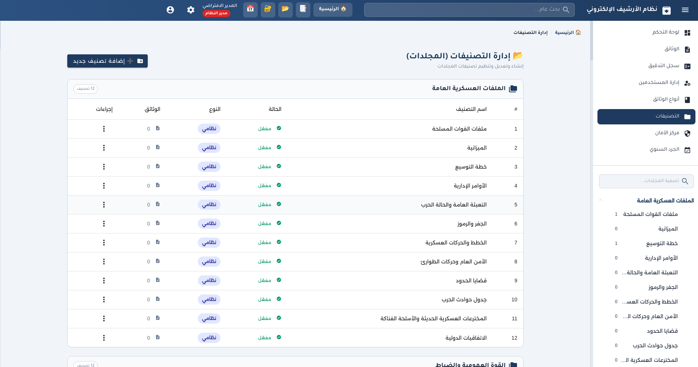

# نظام الأرشيف الإلكتروني — مركز البنيان

<p align="center">
  
</p>

<p align="center">
  <strong>نظام أرشفة إلكتروني متكامل وآمن يعمل 100% بدون إنترنت</strong><br>
  <em>مركز البنيان لتقنية والصناعيات الهندسية — مصراتة، ليبيا</em>
</p>

<p align="center">
  
  
  
  
</p>

---

## 📋 نظرة عامة

**نظام الأرشيف الإلكتروني** هو تطبيق سطح مكتب احترافي مبني بأحدث التقنيات لتلبية احتياجات **مركز البنيان لتقنية والصناعيات الهندسية** في مصراتة. يتيح النظام إدارة 177+ تصنيف من الوثائق مع مستويات سرية، أنواع وثائق ديناميكية، إدارة المستخدمين، الجرد السنوي، والتدقيق الكامل — كل ذلك يعمل بشكل كامل دون الحاجة إلى اتصال بالإنترنت.

### 🎯 المميزات الرئيسية

| الميزة | الوصف |
|--------|-------|
| 🔐 **مستويات السرية** | عادي / سري / سري للغاية مع التحقق من كلمة المرور ورمز النظام |
| 📑 **أنواع الوثائق الديناميكية** | إدارة أنواع الوثائق (صادر، وارد، مراسلات + أنواع مخصصة) |
| 📂 **إدارة 177+ تصنيف** | إضافة/تعديل/تعطيل التصنيفات مع حماية التصنيفات النظامية |
| 👥 **إدارة المستخدمين** | أدوار متعددة (مدير / محرر / مشاهد) مع صلاحيات دقيقة |
| 📅 **الجرد السنوي** | إغلاق السنة مع نسخة احتياطية كاملة وأرشفة منفصلة |
| 🔑 **إدارة كلمات المرور** | تغيير ذاتي، إعادة تعيين من المدير، وطلبات انتظار الموافقة |
| ✍️ **توقيع إلكتروني** | لوحة توقيع داخلية لكل وثيقة |
| 📎 **المرفقات** | سحب وإفلات مع دعم PDF وOffice والصور |
| 🔍 **بحث وتصفية** | بحث فوري مع فلاتر نوع الوثيقة والسرية والمجلد |
| 📊 **لوحة تحكم** إحصائيات مرئية وسجل نشاط |
| 🖨️ **طباعة** | طباعة الوثائق مباشرة |
| 📥 **تصدير/استيراد JSON** | نسخ احتياطي كامل للبيانات |

---

## 🛠️ المتطلبات التقنية

- **Node.js:** 20 أو أحدث
- **Bun:** أحدث إصدار مستقر (مدير الحزم المستخدم)
- **نظام التشغيل:** Windows 10/11 (64-bit) أو Linux (Debian/Ubuntu)
- **ذاكرة عشوائية:** 4 GB على الأقل (موصى به 8 GB)
- **مساحة قرص:** 500 MB للتثبيت + مساحة الوثائق

---

## ⚡ البدء السريع

### 1. تثبيت الاعتماديات

```bash
bun install
```

> إذا واجهت مشكلة في بناء وحدة `better-sqlite3`، شغّل:
> ```bash
> bun run postinstall
> ```

### 2. التشغيل في وضع التطوير

```bash
bun run start
```

### 3. تسجيل الدخول الافتراضي

- **اسم المستخدم:** `admin`
- **كلمة المرور:** `admin123`

> ⚠️ يُنصح بتغيير كلمة المرور الافتراضية فور أول تسجيل دخول.

---

## 📦 بناء النسخ الإنتاجية

### Windows — مثبت NSIS (.exe)

```bash
bun run dist:win
```

> على Linux يتطلب بناء مثبت Windows تثبيت **Wine**. إذا لم يكن متوفراً:

```bash
# نسخة محمولة (.exe واحد) بدون تثبيت
bun run build:win
```

### Linux — AppImage / DEB

```bash
# AppImage
bun run build:linux

# حزمة .deb
bun run build:linux-deb
```

ثم ثبّت الحزمة على Debian/Ubuntu:

```bash
sudo dpkg -i release/bonyan-archive-system-*.deb
```

### بناء عام

```bash
bun run build:prod
```

---

## 🏗️ التقنية المستخدمة

| الطبقة | التقنية |
|--------|---------|
| الواجهة الأمامية | Angular 17+ (Standalone Components) |
| سطح المكتب | Electron 30+ |
| قاعدة البيانات | SQLite3 عبر better-sqlite3 |
| تصميم الواجهة | Angular Material + Tailwind CSS |
| إدارة الحالة | Angular Signals |
| التجميع | electron-builder |
| البروتوكول المخصص | `app://` (لحل مشاكل المسار في النسخ المجمعة) |

---

## 👥 الأدوار والصلاحيات

| الصلاحية | المدير | المحرر | المشاهد |
|----------|:------:|:------:|:-------:|
| إضافة وثيقة | ✅ | ✅ | ❌ |
| تعديل وثيقة | ✅ | ✅ | ❌ |
| حذف وثيقة | ✅ | ✅ | ❌ |
| عرض وثيقة عادي | ✅ | ✅ | ✅ |
| عرض وثيقة سري | ✅ | ✅ | ❌ |
| عرض وثيقة سري للغاية | ✅ | ❌ | ❌ |
| إدارة المستخدمين | ✅ | ❌ | ❌ |
| أنواع الوثائق | ✅ | ❌ | ❌ |
| التصنيفات | ✅ | ❌ | ❌ |
| مركز الأمان | ✅ | ❌ | ❌ |
| الجرد السنوي | ✅ | ❌ | ❌ |
| تصدير/استيراد | ✅ | ❌ | ❌ |
| تغيير كلمة المرور | ✅ | ✅ | ✅ |

---

## 🔐 مستويات السرية

| المستوى | اللون | متطلبات الوصول |
|---------|-------|----------------|
| 🟢 عادي | أخضر | بدون كلمة مرور إضافية |
| 🟡 سري | برتقالي | إعادة إدخال كلمة المرور + 3 محاولات كحد أقصى |
| 🔴 سري للغاية | أحمر | كلمة المرور + رمز تحقق 6 أرقام من مركز الأمان |

> رمز التحقق يُولّد من مركز الأمان، ويُعرض للمدير مرة واحدة فقط. يُخزّن في قاعدة البيانات بصيغة Hash فقط.

---

## 📂 بنية المشروع

```
bonyan-archive-system/
├── electron/                  # العملية الرئيسية لـ Electron
│   ├── main.ts               # IPC handlers + نوافذ التطبيق
│   ├── preload.ts            # واجهة آمنة للـ renderer
│   └── database.ts           # SQLite schema + migrations + logic
├── src/app/
│   ├── components/           # مكونات Angular
│   │   ├── security-center/
│   │   ├── security-modal/
│   │   ├── document-type-management/
│   │   ├── folder-category-management/
│   │   ├── annual-closing/
│   │   ├── change-password/
│   │   ├── password-reset-request/
│   │   └── ...
│   ├── services/             # الخدمات
│   ├── models/               # النماذج والأنواع
│   ├── guards/               # حماية المسارات
│   └── directives/           # توجيهات الصلاحيات
├── src/assets/               # الأصول والبيانات
├── docs/                     # الوثائق والصور
├── PROPRIETARY-LICENSE.md    # الترخيص الحصري
└── NOTICE.md                 # الإشعار القانوني
```

---

## ⚙️ التفضيلات والإعدادات

يُخزّن التطبيق إعداداته وقاعدة البيانات في المسارات الافتراضية للنظام:

- **Windows:** `%APPDATA%\bonyan-archive-system\archive.db`
- **Linux:** `~/.config/bonyan-archive-system/archive.db`
- **النسخ الاحتياطية:** `backups/archive_YYYY_<timestamp>.db`

للاطلاع على كافة التفضيلات وخيارات التخصيص، راجع [docs/PREFERENCES.md](docs/PREFERENCES.md).

---

## 📸 لقطات من المنصة

فيما يلي نظرة سريعة على أهم شاشات النظام:

### شاشة تسجيل الدخول

<p align="center">
  
</p>

<p align="center">
  <em>واجهة بسيطة وآمنة للدخول إلى النظام باستخدام اسم المستخدم وكلمة المرور.</em>
</p>

### لوحة التحكم

<p align="center">
  
</p>

<p align="center">
  <em>لوحة مركزية تعرض إجمالي الوثائق وأنواعها، مع سجل النشاطات اليومية.</em>
</p>

### إدارة الوثائق

<p align="center">
  
</p>

<p align="center">
  <em>عرض وبحث الوثائق مع تصفية حسب النوع ومستوى السرية والمجلد.</em>
</p>

### مركز الأمان

<p align="center">
  
</p>

<p align="center">
  <em>توليد رموز التحقق الآمنة للوصول إلى الوثائق السرية للغاية.</em>
</p>

### الجرد السنوي

<p align="center">
  
</p>

<p align="center">
  <em>إغلاق السنة الحالية وأرشفة الوثائق مع نسخة احتياطية كاملة.</em>
</p>

### إدارة التصنيفات

<p align="center">
  
</p>

<p align="center">
  <em>إدارة 177+ تصنيف منظمة في مجموعات، مع إمكانية الإضافة والتعديل.</em>
</p>

> **ملاحظة:** الصور أعلاه لتوضيح طريقة عمل النظام. يمكن استبدالها بلقطات شاشة حقيقية من التطبيق بعد التشغيل.

---

## 📄 الترخيص والملكية

هذا المشروع ملكية خاصة حصريّة لـ **مركز البنيان لتقنية والصناعيات الهندسية — مصراتة، ليبيا**.

- راجع [PROPRIETARY-LICENSE.md](PROPRIETARY-LICENSE.md) للحصول على الترخيص الكامل.
- راجع [NOTICE.md](NOTICE.md) للإشعار القانوني.

لا يجوز استخدام أو نسخ أو توزيع أو تعديل هذا النظام من قِبل أي جهة أخرى دون موافقة خطية صريحة من إدارة مركز البنيان.

---

## 🏷️ الإصدارات

- **v1.1.0** — النسخة المعتمدة الحالية (الجرد السنوي + مستويات السرية + أنواع الوثائق الديناميكية + إدارة التصنيفات)
- **v1.0.0** — النسخة الأولى (الوثائق والمستخدمين والتدقيق)

---

## 📞 الدعم والتواصل

للاستفسارات الفنية أو طلبات الدعم:

> **مركز البنيان لتقنية والصناعيات الهندسية**  
> **مصراتة — الجماهيرية الليبية**

---

<p align="center">
  <sub>صُنع بإتقان لمركز البنيان — © 2026</sub>
</p>
